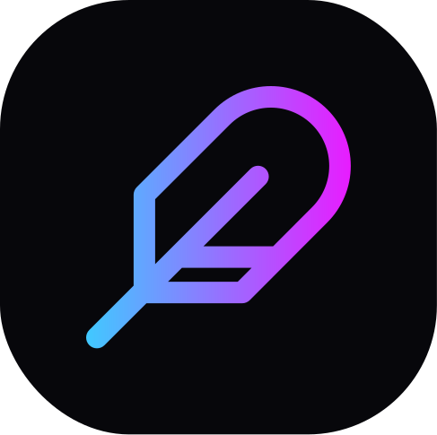
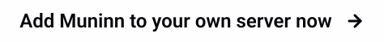

# Muninn Bot


Muninn is a Discord bot to add a experience system that members can get by intereating on voice channels.

\&nbsp;

[](https://discord.com/api/oauth2/authorize?client_id=940773931504267314&permissions=1101961103360&scope=applications.commands%20bot)

## License

[MIT](https://github.com/tobiasMarion/muninnBot/blob/main/LICENSE)

## Techs

* [Discord.js](https://discord.js.org/)
* [MongoDB](https://www.mongodb.com/home) and [Mongoose](https://mongoosejs.com/)

## Run Locally

1. Clone the project
    ```bash
    git clone https://github.com/tobiasMarion/muninnBot
    ```

2. Go to the project directory
    ```bash
    cd muninnBot
    ```

3. Install dependencies
    ```bash
    npm install
    ``` 

4. Set up environment variables to your .env file
    * `TOKEN`: A discord bot token. To get this token you'll have to create an application on [Discord Developers Panel](https://discord.com/developers/applications).
    * `CLIENT_ID`: Also can be gotten on [Discord Developers Panel](https://discord.com/developers/applications) after you create an application.
    * `DB_URI`: The URI to connect to your [MongoDB](https://www.mongodb.com/home) Database.

5. Start the server
    ```bash
    npm run start
    ```
